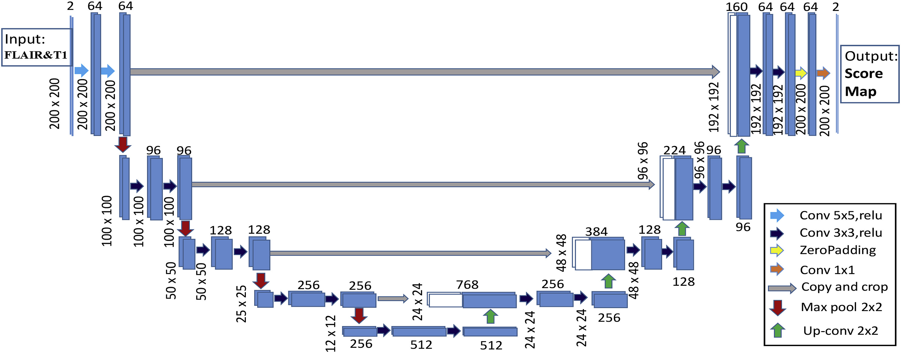
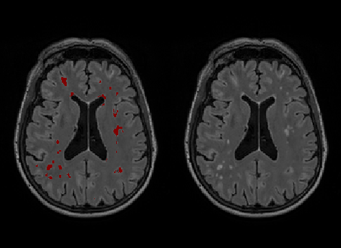

# wmh_MICCAI_tf2
Re-implementation of the winning method in MICCAI 2017 WMH segmentation challenge created by **Hongwei Li et al.** ([github](https://github.com/hongweilibran/wmh_ibbmTum), [original paper](https://doi.org/10.1016/j.neuroimage.2018.07.005)] in TensorFlow2/Keras 2 API: the method **uses a 2D Convolutional Neural Network (CNN) Architecture based on U-net** to segment White Matter Hyperintensities (WHM).

Network Architecture:





Example of results on MRI data acquired in [Cubric](https://www.cardiff.ac.uk/cardiff-university-brain-research-imaging-centre)




### Description

This repository contains my re-emplemenation of the github code for segmentation White matter hyperintensities (WMH) on FLAIR/T1 mri data. The purpose was to use a CNN approach to segment WHM on 3D FLAIR/T1 data acquired on a 3T Prisma Scanner with *1mm isotropic* resolution in [Cubric](https://www.cardiff.ac.uk/cardiff-university-brain-research-imaging-centre). The scripts can be run using command line arguments so that they can be intergrated in your MRI data analysis pipeline.

The main changes are the following: 
- Code is now compatible with **TensorFlow2** and **Keras 2.3.1**
- Added a preprocessing script to register a pair FLAIR and T1 images using **Nipype** (calling **Ants** for skullstripping/registration/Bias correction) that accepts command line arguments
- Added a script to segment preprocessed data using pre-trained ensemble neural networks (added plotting functionality to QC the data)
- Modified training script to that weights avaialble from the original repository can be updated (in my case I retrained the networks using manually labeled data from 10 participants). Changed fitting to *model.fit_generator* using a custom Keras *ImageDataGenerator* for data augmentation).
- Added a script to concatenate and QC training examples


## Instructions

All code runs on Python 3. In order to run the code the following libraries and MRI tool are required (which can be installed in a conda environment):
```
Requirements: 
Keras 2.3.1, TensorFlow 2.0, Python 3.6.8, h5py, scipy, nipype (Ants/Afni), nibabel 
```

##### Important Note: use optional arguments to save and QC images (ouput should be axial slices as in example above). Images are expected to be in the format x,y by z(axial slices), i.e. shape is 200x200x150 (150 slices in head to foot direction) upon loading with nibael. Axes can be swapped differently by modifying the code.

For each participant preprocess a pair of T1 and T2 FLAIR using preproc_FLAIR_MPRAGE.py (mask argument is optional, if not provided it will skullstrip the T1 image using [antsBrainExtraction.sh](https://github.com/ANTsX/ANTs/blob/master/Scripts/antsBrainExtraction.sh) using the [OASIS template](https://osf.io/rh9km/) which is time consuming)  

```
python preproc_FLAIR_MPRAGE.py -t pid01.T1.nii.gz -f pid01.FLAIR.nii.gz -m pid01.maks.nii.gz -p pid01

```
To test the segmentation on the original pre-trained weights (obtained from [here]( https://github.com/hongweilibran/wmh_ibbmTum)) run the following:

```
python miccai_segment.py -f pid01.FLAIR.nii.gz -t pid01.mprage.to_FLAIR.nii.gz -m mask.nii.gz -o whm.nii.gz

```

Assembling a dataset to retrain the original network on some novel training data (i.e. from your scanner).  Use the following script (which expects all the outputs from *preproc_FLAIR_MPRAGE.py* to be in a single folder. Two output *.npy files (one for T1/FLAIR images and one for masks) will be generated.

```
python build_dataset_for_miccai.py

```
To retrain a single network (using a Keras Initializers, or other custom weights (e.g. from the original [repository]( https://github.com/hongweilibran/wmh_ibbmTum)) on a GPU use the following:

```
python miccai_train_on_new_data.py
```
Training logs and weights will be saved
